# OBS Lower-Third
    Plugin de lower-third para OBS usando o Docas para navegador.

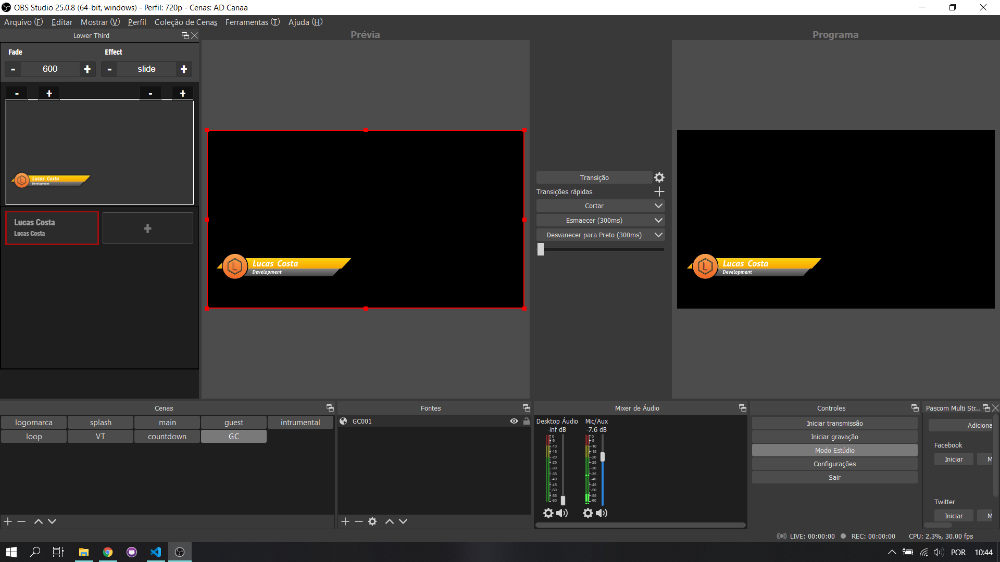

## Tecnologia
    Framework Angular JS

## Processo de instalação
1. Baixe o arquivo **zip** e descompacte em uma pasta qualquer
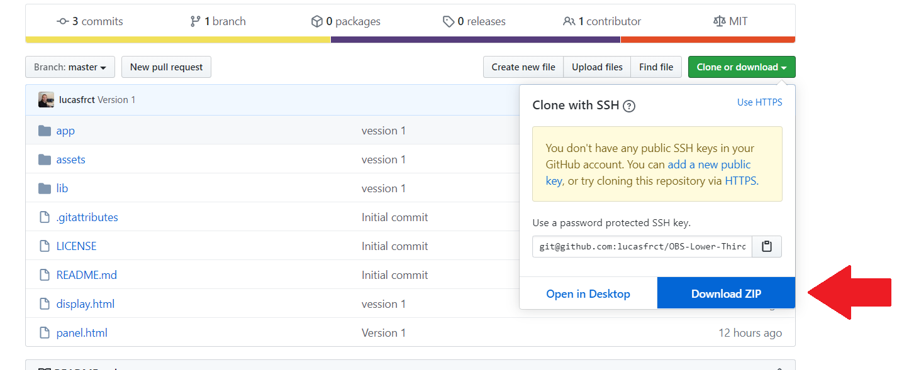

2. Dentro da pasta tem dois arquivos **.html**, o **panel.html** e o **display.html**, o arquivo  **panel.html** é o painel de controle e o arquivo **display.html** é a tela que mostra a lower-third
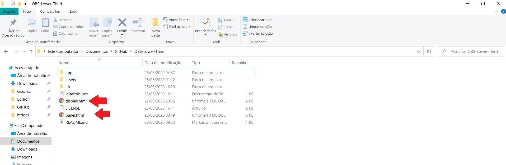

3. No OBS, clique em **Mostrar** na barra de menu superior. Depois clique em *Docas*, no submenu clique em **Docas para navegador persinalizado** (**Mostrar > Docas > Docas para navegador Personalizado**)

4. Na janela que abre, adiciona um nome para esse painel no campo **nome da doca** e no campo **URL** adcinione o caminho par ao arquivo **panel.html** e clique em **Fechar**.
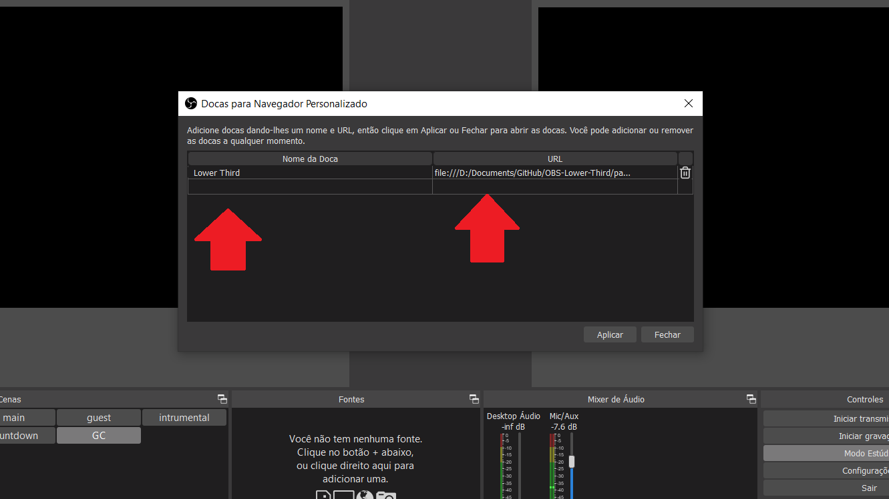

5. Posicione a nova doca na lateral do OBS para visualizar o painel de **Lower-Thirds**
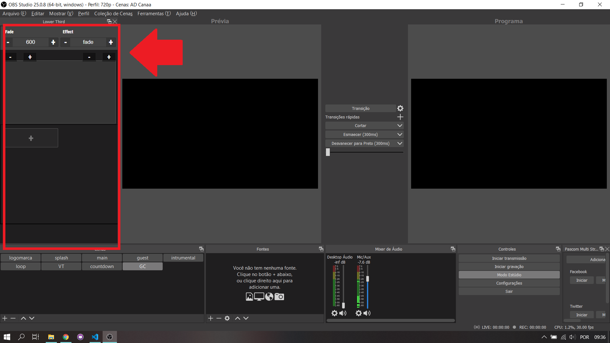

6. Abra uma cena e adicione uma fonte para navegador
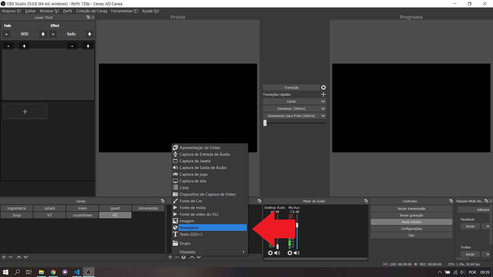

7. Nas propiedades da fonte de navegador, marque como **Arquivo local**, clique em **Localizar** e navegue até a pasta **OBS-Lower-Thids** e selecione o arquivo **display.html**. Defina a tela para **1280x720** (o arquivo display precisa reconhecer a tela inteira) e clique em **ok**
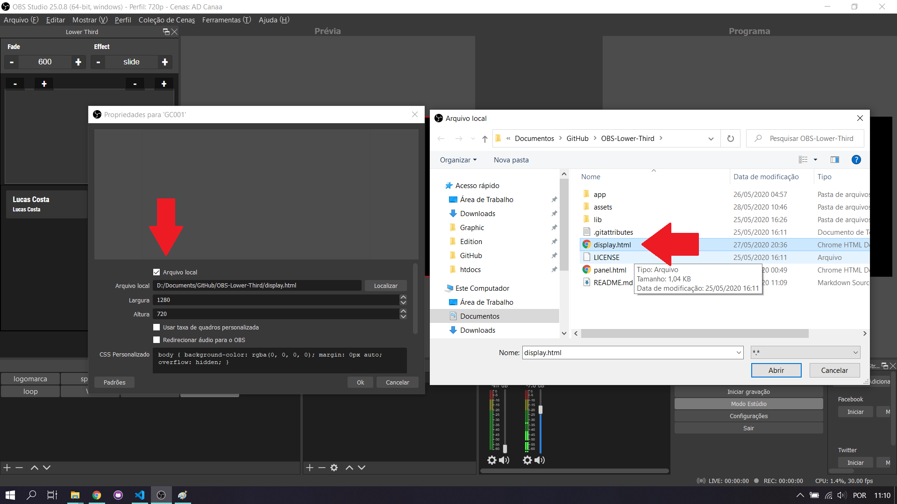

##  Como Usar:
- Clique em **ADD** Lower-Third
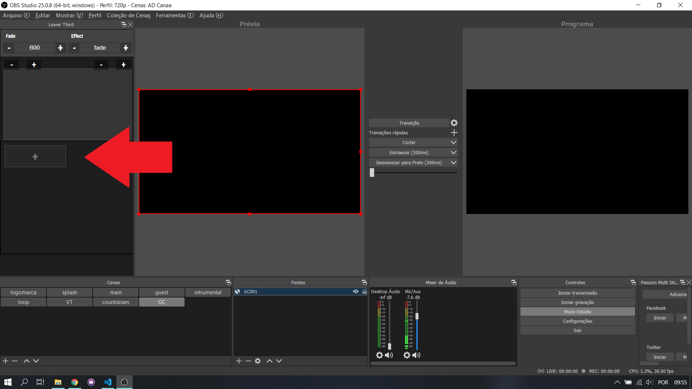

- Digite um *título*, cole um **caminho de uma imagem .png* e digite o **texto** e clique em **save**
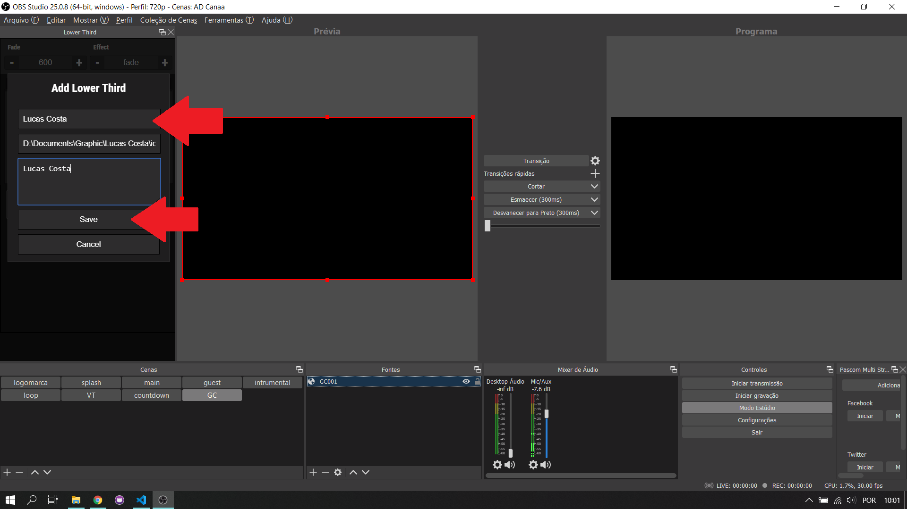

- Clique no lower-third para que ele apareça na tela.
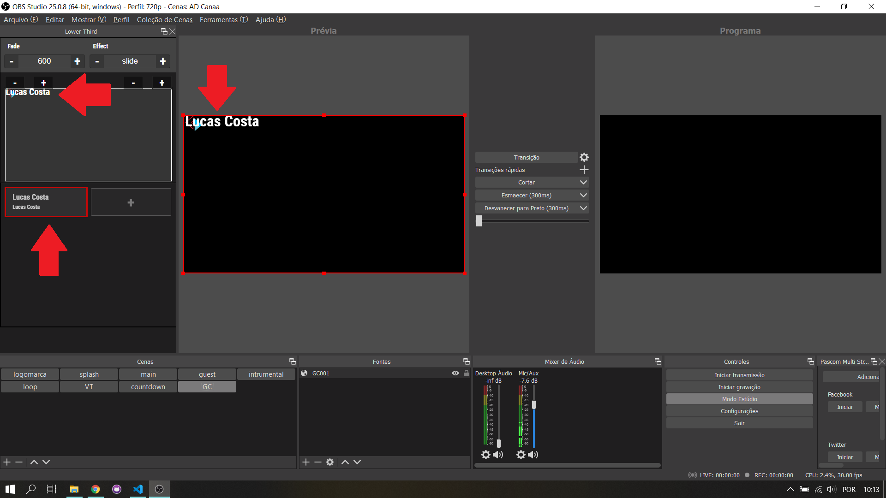

- Para deletar, basta clicar duas vezes sobre o lower-third e confirmar
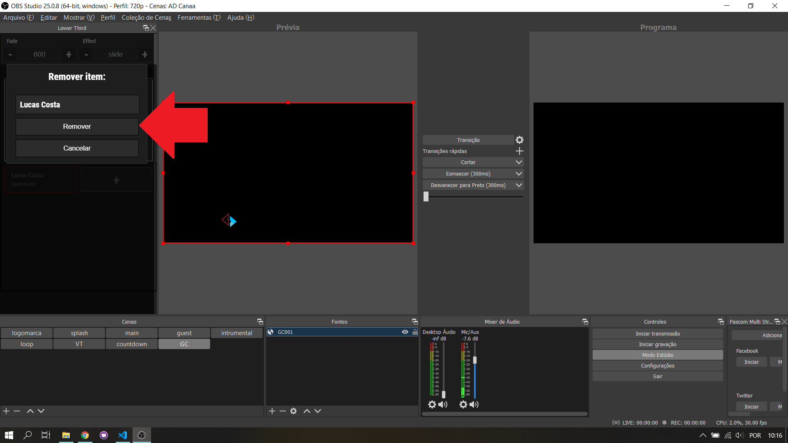

 
